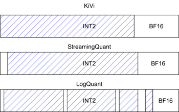
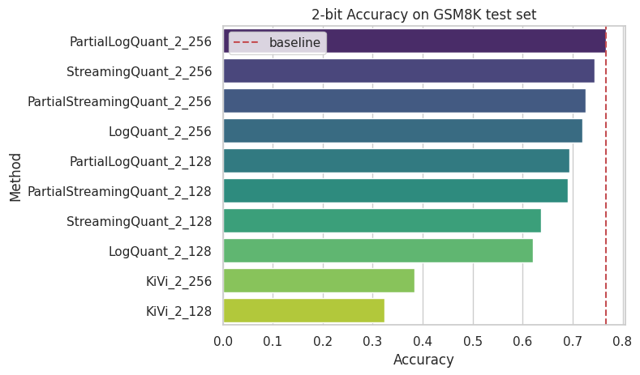
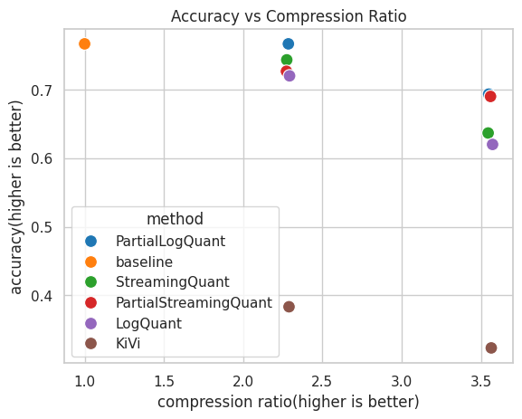

# LogQuantKV
LogQuantKV, a high precision 2-bit Quantization method.

## Method

sparse attention + quantization



## Evalutation

* first 300 questions of [GSM8K: test](https://huggingface.co/datasets/openai/gsm8k/viewer/main/test) with llama3-8B-Instruct
* Method\_\<n-bit\>\_\<full precision length\>





## how to use

### requirements

* torch>=2.3
* transformers>=4.42
* quanto==0.2.0

```bash
pip install -U transformers quanto==0.2.0
```

### implemented methods

* StreamingQuant: total full precision tokens memory cost will be [sink + 2*window_length]
* LogQuant: total full precision tokens memory cost will be [3*window_length]
* PartialStreamingQuant: total full precision tokens memory cost will be [sink + 1.5*window_length]
* PartialLogQuant: total full precision tokens memory cost will be [2*window_length]

### use with huggingface models

* example of StreamingQuant

```python
import torch
from transformers import AutoModelForCausalLM, AutoTokenizer
from src.LogQuant import QuantoStreamingQuantizedCache, StreamingQuantizedCacheConfig

device = "cuda:0" if torch.cuda.is_available() else "cpu"
model_name = "Qwen/Qwen1.5-7B-Chat"

model = AutoModelForCausalLM.from_pretrained(
    model_name,
    torch_dtype="auto",
    device_map=device,
)
tokenizer = AutoTokenizer.from_pretrained(model_name)

config =  StreamingQuantizedCacheConfig(
            backend="quanto",
            nbits=2,
            window_length=8,
            sink_length=4,
            compute_dtype="auto",
            device=device,
        )
cache = QuantoStreamingQuantizedCache(config)

messages = [
    {
        "role": "system",
        "content": "You are a helpful assistant."
    },
    {
        "role": "user", 
        "content": "如果把脏话都说出来了，那么嘴是不是就干净了"
    }]

prompt = tokenizer.apply_chat_template(messages, tokenize=False, add_generation_prompt=True)

input_ids = tokenizer(prompt, return_tensors="pt").input_ids.to(device)

output = model.generate(input_ids, max_new_tokens=128, past_key_values=cache)

print(tokenizer.decode(output[0], skip_special_tokens=True))
'''
system
You are a helpful assistant.
user
如果把脏话都说出来了，那么嘴是不是就干净了
assistant
把脏话或不文明的语言说出口，并不能真正使嘴巴“干净”，反而可能会带来更负面的影响。语言是表达思想和情感的工具，应该尊重并用得当。即使在某些情况下我们可能无意中说出脏话，但真正的“干净”在于我们的言行是否得体，是否尊重他人，是否能传达积极的信息。

真正的“干净”是内心的修养和道德素质的体现，而不是通过粗俗的言辞来掩饰。我们应该努力培养良好的语言习惯，用积极、礼貌的语言与人交流，这样才能真正体现出我们的素质和教养。
'''
```

* example of LogQuant

```python
import torch
from transformers import AutoModelForCausalLM, AutoTokenizer
from src.LogQuant import QuantoLogQuantizedCache, LogQuantizedCacheConfig

device = "cuda:0" if torch.cuda.is_available() else "cpu"
model_name = "Qwen/Qwen1.5-7B-Chat"

model = AutoModelForCausalLM.from_pretrained(
    model_name,
    torch_dtype="auto",
    device_map=device,
)
tokenizer = AutoTokenizer.from_pretrained(model_name)

config = LogQuantizedCacheConfig(
            backend="quanto",
            nbits=2,
            window_length=4,
            compute_dtype="auto",
            device=device,
        )
cache = QuantoLogQuantizedCache(config)

messages = [
    {
        "role": "system",
        "content": "You are a helpful assistant."
    },
    {
        "role": "user", 
        "content": "如果把脏话都说出来了，那么嘴是不是就干净了"
    }]

prompt = tokenizer.apply_chat_template(messages, tokenize=False, add_generation_prompt=True)

input_ids = tokenizer(prompt, return_tensors="pt").input_ids.to(device)

output = model.generate(input_ids, max_new_tokens=128, past_key_values=cache)

print(tokenizer.decode(output[0], skip_special_tokens=True))
'''
system
You are a helpful assistant.
user
如果把脏话都说出来了，那么嘴是不是就干净了
assistant
不，把脏话或不尊重的语言说出口并不会让嘴巴变得干净。恰恰相反，这通常会显示出粗俗、不礼貌或者情绪失控。真正的“干净”是通过言语和行为展现出尊重、理解、宽容和礼貌。即使在压力或冲突的情况下，我们也应该努力控制自己的言辞，用更建设性的方式表达我们的想法。
'''
```

